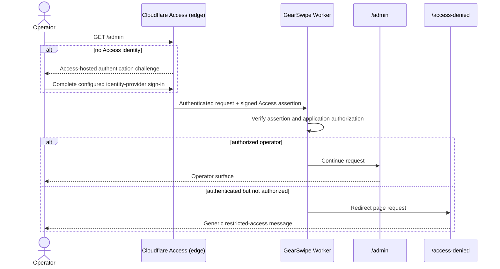

# GearSwipe Cloudflare Access setup

## Decision

`https://gearswipe.com/admin` is the only production entry point for operator
authentication. Cloudflare Access owns the authentication challenge at the
edge, before a request reaches the GearSwipe Worker. Do not add a GearSwipe
Google OAuth page or another production login route. A separate public-account
requirement must be approved before any second identity flow is introduced.

`/login` exists only as a compatibility redirect: one `307` response points to
`/admin`. It never starts OAuth and must not redirect back to itself.

## Authentication sequence

The denial page must not reveal allowlists, policy rules, tokens, identity
claims, or whether an account exists. Admin API routes never redirect to an
HTML page: they return JSON `401` for a request without usable authentication
and JSON `403` for an authenticated identity that lacks application access.

## Production configuration

1. In Cloudflare Zero Trust, create a self-hosted Access application covering
   the production `/admin*` path.
2. Cover `/api/admin*` with the same identity boundary. Keep the application's
   policy and identity-provider configuration in Cloudflare, not in source.
3. Set `CLOUDFLARE_TEAM_NAME` and `GEARSWIPE_ADMIN_EMAILS` as Worker runtime
   configuration. Do not commit their production values.
4. Ensure Access forwards its signed assertion. The Worker verifies it before
   server-rendered admin code accepts the identity.
5. Test `/admin`, a nested admin page, and an admin API endpoint through the
   deployed hostname. Going directly to an unprotected Worker hostname is not
   a supported production authentication path and should be blocked.

Cloudflare Access logs are the source for edge authentication events. GearSwipe
application audit records remain the source for actions taken after admission.

## Local-only fallback

Cloudflare Access headers are unavailable on localhost. NextAuth therefore
remains solely as a local development session mechanism and is enabled only
when all of the following are true:

- `NODE_ENV` is not `production`;
- `GEARSWIPE_ENABLE_LOCAL_CREDENTIALS=true`;
- local-only `GEARSWIPE_ADMIN_EMAIL` and `GEARSWIPE_ADMIN_PASSWORD` values are
  present; and
- the email is included in the local `GEARSWIPE_ADMIN_EMAILS` value.

Set `AUTH_SECRET` for the local session. The fallback uses credentials, not a
Google provider. It does not change the production sequence, and its secrets
must never be placed in source or deployed as a substitute for Access.

## Validation and failure behavior

- An unauthenticated production visit to `/admin` is challenged by Cloudflare
  Access without first reaching the Worker.
- An authenticated, application-authorized visit renders `/admin`.
- An authenticated but application-unauthorized page visit reaches the generic
  `/access-denied` surface.
- An unauthorized admin API call receives JSON and never an HTML redirect.
- `/login` produces exactly one same-origin redirect to `/admin`.

If Access is not challenging production requests, treat that as a deployment
misconfiguration. Fail closed; do not enable a second OAuth implementation as
a workaround. Roll back the deployment or repair the Access application.
